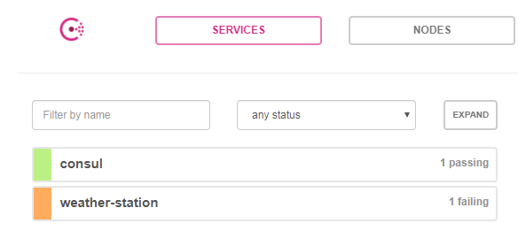
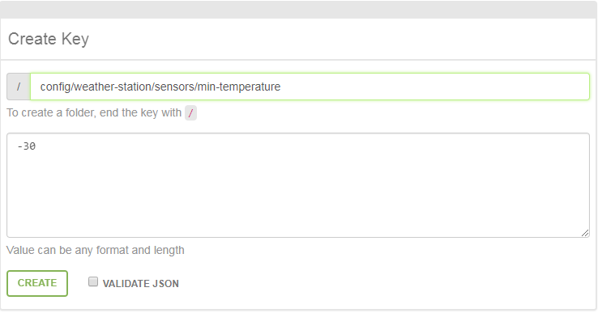
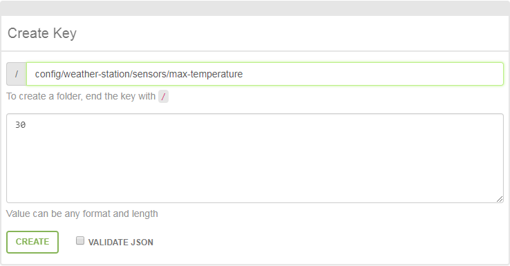

## Weather Station: Health Check / Service Discovery

```java
package weather.sensors;

import weather.WeatherProperties;
import org.springframework.boot.actuate.health.Health;
import org.springframework.boot.actuate.health.HealthIndicator;
import org.springframework.boot.actuate.health.Status;

public class SensorsHealthIndicator implements HealthIndicator {

    private final WeatherProperties weatherProperties;
    private final SensorsProperties sensorsProperties;

    public SensorsHealthIndicator(WeatherProperties weatherProperties, SensorsProperties sensorsProperties) {
        this.weatherProperties = weatherProperties;
        this.sensorsProperties = sensorsProperties;
    }

    @Override
    public Health health() {
        if (weatherProperties.getTemperature() < sensorsProperties.getMinTemperature()) {
            return Health.status(Status.DOWN).withDetail("reason", "temperature is too low").build();
        } else if (weatherProperties.getTemperature() > sensorsProperties.getMaxTemperature()) {
            return Health.status(Status.DOWN).withDetail("reason", "temperature is too high").build();
        } else {
            return Health.status(Status.UP).build();
        }
    }
}
```
After setting temperature less than `sensors.min-temperature`:

```yml
weather:
  temperature: -40
```
The result of visiting [http://localhost:8080/health](http://localhost:8080/health) should be similar to:

```json
{
  "status": "DOWN",
  "sensors": {
    "status": "DOWN",
    "reason": "temperature is too low"
  },
  "diskSpace": {
    "status": "UP",
    "total": 25230176256,
    "free": 1949147136,
    "threshold": 10485760
  },
  "hystrix": {
    "status": "UP"
  },
  "consul": {
    "status": "UP",
    "leader": "127.0.0.1:8300",
    "services": {
      "consul": [],
      "weather-station": []
    }
  }
}
```
Service should be failing consul health-check:



## Weather Station: Key/Value Store




## Weather Forecast: Load Balancing / Failover
To start service on particular port we can pass `-Dserver.port=` parameter in IDE or using command line:

```bash
java -Xms256m -Xmx256m -Dserver.port=8081 -jar weather-station/build/libs/weather-station-0.0.1.jar
java -Xms256m -Xmx256m -Dserver.port=8082 -jar weather-station/build/libs/weather-station-0.0.1.jar
java -Xms256m -Xmx256m -Dserver.port=8083 -jar weather-forecast/build/libs/weather-forecast-0.0.1.jar
```

Assuming we have started weather-stations on ports (8081, 8082) and weather-forecast on port 8083
then [forecast](http://localhost:8083/weather) endpoint should alternate between weather-station instances:

```json
{
  "temperature": 20,
  "feelsLikeTemperature": 14,
  "description": "forecast based on weather-station-8081"
}
```
```json
{
  "temperature": 20,
  "feelsLikeTemperature": 14,
  "description": "forecast based on weather-station-8082"
}
```

After killing one of instances traffic should be forwarded only to the other:

```json
{
  "temperature": 20,
  "feelsLikeTemperature": 14,
  "description": "forecast based on: weather-station-8081"
}
```

## Weather Forecast: Routing / Tags
To start service on particular port and pass property we can use IDE or command line:

```bash
java -Xms256m -Xmx256m -Dserver.port=8081 -Dspring.cloud.consul.discovery.tags=v1 -jar weather-station/build/libs/weather-station-0.0.1.jar
java -Xms256m -Xmx256m -Dserver.port=8082 -Dspring.cloud.consul.discovery.tags=v2 -jar weather-station/build/libs/weather-station-0.0.1.jar
java -Xms256m -Xmx256m -Dserver.port=8083 -Dspring.cloud.consul.discovery.server-list-query-tags.weather-station=v2 -jar weather-forecast/build/libs/weather-forecast-0.0.1.jar
```

Assuming we have started weather-stations on ports (8081, 8082) and weather-forecast on port 8083
then [forecast](http://localhost:8083/weather) endpoint should return forecast only from second instance

```json
{
  "temperature": 20,
  "feelsLikeTemperature": 14,
  "description": "forecast based on weather-station-8082"
}
```